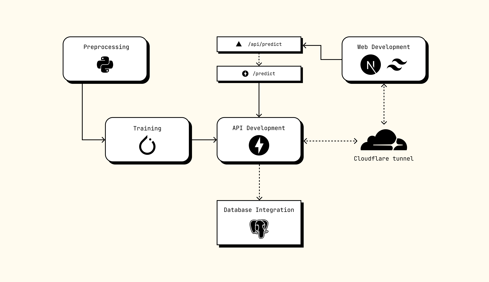

  <a href="#introduction">Introduction</a> •
  <a href="#overview">Overview</a> •
  <a href="#list-of-repos">List of Repos</a>

 

# Introduction

🙋‍♀️ Welcome to BOLI. This organisation serves as a collection for all the code I have written for my Masters Thesis (MSc Cyber Security Module CYM500). It is currently under development!

👩‍💻 There are several repositories here. Some will be private due to the Data Protection Policies. [Email me](mailto:shrutipriya44@gmail.com) to get details about the private repos.

🍿 I wonder what would Mirza Ghalib think if we brought him to life today and told him man has set foot on the moon, he would probably be sad—हमने चाँद को नापाक कर दिया

## Overview

Here's a high-level layout of the project alongwith the implemented tech stack. 

## List of repos

| Repo | Status | Tech Stack | Objective|
|:------|:------|:-----------|:------|
|[preprocessing](https://github.com/hate-detection/preprocessing)|Private| |Prepocessing Pipeline for dataset in 2 phases. Current staus Private due to Data Usage Policies and requirements by dataset authors.
|[training](https://github.com/hate-detection/training)|Public|  |Defining training pipeline for the model. Includes ML algorithms, full-model MuRIL fine-tuning and MuRIL fine-tuning with adapters.
|[model-inference-api](https://github.com/hate-detection/model-inference-api)|Public|  |Serving the model through API for inference.
|[boli-app](https://github.com/hate-detection/boli-app)|Public|  |Frontend web-application for Machine Learning Model.
